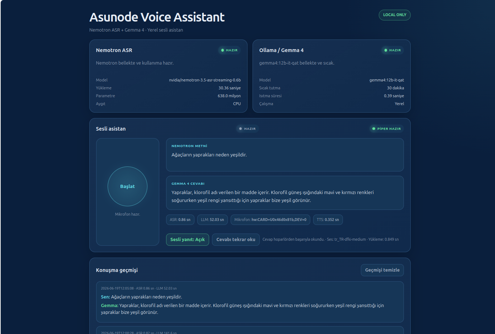

# Asunode Local Voice Assistant

[English](README.md) | [Türkçe](README.tr.md)

> A fully local, CPU-only voice assistant pipeline built with NVIDIA Nemotron ASR, Ollama/Gemma, Piper TTS, FastAPI and ALSA.

Asunode Local Voice Assistant is a local-only Turkish voice assistant prototype built around a push-to-talk workflow:



```text
Logitech/ALSA microphone
→ NVIDIA Nemotron 3.5 ASR Streaming 0.6B
→ Ollama / Gemma 4 12B
→ Piper TTS
→ Speakers
```

Audio recording, speech recognition, language-model inference, and speech synthesis all run on the local machine. By default, the web interface listens only on `127.0.0.1`.

The current web interface and default assistant responses are configured for Turkish.

## Features

- Local-only, CPU-only operation
- Turkish ASR and Turkish TTS
- Local Gemma 4 model served through Ollama
- FastAPI-based web interface
- Keeping the Nemotron, Gemma, and Piper models loaded and warm
- Start/stop recording controls
- Display of the ASR transcript and LLM response
- Automatic spoken responses and replay of the latest response
- Local conversation history
- Example user-level systemd service
- Parliament-blue interface theme

## Tested system

The project has been verified on the following single system:

| Component | Value |
|---|---|
| Operating system | Ubuntu 25.10 |
| Python | 3.13.7 |
| CPU | Intel Core i5-11600K |
| Memory | 32 GB |
| Execution mode | CPU-only |
| PyTorch | 2.12.1+cpu |
| TorchAudio | 2.11.0+cpu |
| NeMo | GitHub `main`, verified commit `0f378e9d8` |
| Microphone | Logitech USB webcam microphone |
| LLM server | Ollama |
| LLM | `gemma4:12b-it-qat` |

GPU performance and other operating systems have not been tested. The complete environment versions are recorded in [requirements/main-lock.txt](requirements/main-lock.txt) and [requirements/tts-lock.txt](requirements/tts-lock.txt).

## Observational measurements

Approximate results observed on the test machine on June 19, 2026:

- Nemotron startup load from the local model cache: approximately 30 seconds
- ASR processing for 5–10 seconds of audio: approximately 0.6–1.0 seconds
- Piper model loading: approximately 0.8 seconds
- Piper speech synthesis: approximately 0.1–0.35 seconds
- Gemma 4 CPU response time: approximately 30–140 seconds, depending on the prompt

These are observational measurements from one machine, not a standardized benchmark.

## Development history

1. Verified the Logitech microphone through ALSA.
2. Tested 16 kHz mono WAV recording.
3. Created the Python virtual environment and installed CPU PyTorch.
4. Installed the NeMo ASR dependencies.
5. Downloaded the Nemotron model and loaded it on the CPU.
6. Tested the Turkish `tr-TR` prompt.
7. Resolved `Unknown prompt key: None` by using `RNNTPromptTranscribeConfig`, `target_lang="tr-TR"`, and `use_lhotse=False`.
8. Connected Nemotron output to Ollama/Gemma.
9. Built the FastAPI interface.
10. Dropped Gradio after Gradio 6.19 caused a dependency conflict with the Hugging Face Hub/Transformers stack.
11. Installed Piper in a separate `.venv-tts` environment.
12. Implemented a persistent Piper worker that keeps the voice model loaded.
13. Fixed the `.venv-tts/bin/python` symlink issue where `Path.resolve()` redirected execution to `/usr/bin/python`.
14. Added automatic speaker playback.
15. Added a user-level systemd service.
16. Completed the parliament-blue interface.

## Project roles and AI-assisted development

This project was developed through a human–AI collaboration.

- **Sinan Kurtoğlu — Project owner and system integrator:** defined the project goals, prepared the local hardware and operating environment, performed field tests, evaluated the results, selected the final technical decisions, and approved the release.
- **ChatGPT (GPT-5.5 Thinking) — Architecture and technical guidance:** contributed to system architecture, installation planning, troubleshooting, dependency analysis, debugging strategy, technical explanations, documentation structure, and release preparation.
- **VS Code DAI coding agent — Local implementation assistance:** performed repository inspection, file editing, validation commands, security checks, Git operations, and GitHub publication under human supervision.

All AI-generated recommendations and file changes were reviewed and accepted by the project owner. Responsibility for deployment, testing, and use of the project remains with the project owner and the person operating the system.

## Installation

### 1. System packages

```bash
sudo apt update
sudo apt install -y \
  ffmpeg libsndfile1 alsa-utils git \
  python3-venv python3-dev build-essential
```

If your Ubuntu release provides separate package names for Python 3.13, install the appropriate `python3.13-venv` and `python3.13-dev` packages.

### 2. Ollama and Gemma

Install Ollama separately by following its official installation instructions. Then run:

```bash
ollama pull gemma4:12b-it-qat
```

Verify that the model name is available in your Ollama installation:

```bash
ollama list
```

### 3. Main Python environment

```bash
git clone https://github.com/asunode/asunode-local-voice-assistant.git
cd asunode-local-voice-assistant
python3.13 -m venv .venv
. .venv/bin/activate
python -m pip install --upgrade pip setuptools wheel
```

Install CPU-only PyTorch separately:

```bash
python -m pip install \
  torch==2.12.1+cpu torchaudio==2.11.0+cpu \
  --index-url https://download.pytorch.org/whl/cpu
```

The working NeMo version is installed from the GitHub `main` branch. Install the primary dependencies:

```bash
python -m pip install -r requirements/main.txt
```

To reproduce the exact tested environment, use the lock file instead:

```bash
python -m pip install -r requirements/main-lock.txt
```

The NeMo entry in the lock file is pinned to the verified commit. Newer versions from `main` may introduce incompatibilities.

### 4. Piper TTS environment

Piper is kept separate to avoid dependency conflicts with the main ASR environment:

```bash
python3.13 -m venv .venv-tts
.venv-tts/bin/python -m pip install --upgrade pip
.venv-tts/bin/python -m pip install -r requirements/tts.txt
mkdir -p models/piper
```

Download the `.onnx` and `.onnx.json` files for the Piper `tr_TR-dfki-medium` voice from the Piper voice distribution and place them under `models/piper/`:

```text
models/piper/tr_TR-dfki-medium.onnx
models/piper/tr_TR-dfki-medium.onnx.json
```

The model files are not included in this repository.

### 5. Configuration and microphone

Create the local configuration from the example:

```bash
cp config/app.example.json config/app.json
```

List available microphones:

```bash
arecord -l
```

Set `audio.capture_device` in `config/app.json`. A persistent ALSA device name is recommended instead of a card number that may change:

```json
"capture_device": "hw:CARD=YOUR_MICROPHONE,DEV=0"
```

### 6. Manual startup

Make sure Ollama is running, then start the application:

```bash
.venv/bin/python voice_assistant_ui_stage3.py
```

Open:

```text
http://127.0.0.1:7860
```

The first run requires an internet connection and may take time while Nemotron and other model files are downloaded.

## User-level systemd service

Copy the example service file into the user service directory:

```bash
mkdir -p ~/.config/systemd/user
cp systemd/asunode-voice-assistant.service.example \
  ~/.config/systemd/user/asunode-voice-assistant.service
```

Replace every `__PROJECT_DIR__` placeholder in the copied file with the absolute path to the project. Then run:

```bash
systemctl --user daemon-reload
systemctl --user enable --now asunode-voice-assistant.service
systemctl --user status asunode-voice-assistant.service
journalctl --user -u asunode-voice-assistant.service -f
```

A user-level service normally starts after the user signs in. To run it without an active login session, optionally enable lingering:

```bash
sudo loginctl enable-linger "$USER"
```

## Troubleshooting

### The first word is missing

`arecord` may introduce a short startup delay while opening the device. Wait briefly after pressing the record button before speaking.

### Real streaming

Although the model name includes “streaming,” the current application does not implement real-time PCM streaming. It uses a file-based push-to-talk workflow and processes the WAV file after recording stops.

### Turkish recognition errors

Turkish ASR is not perfect. The local LLM can often correct small phonetic or word-boundary errors from context, but important results should still be verified.

### Gemma is slow or gives an incorrect date

Gemma 4 12B can be slow on a CPU, depending on the prompt. A local LLM does not automatically know the current date. Because the system date is not yet injected into the prompt, date and time answers may be incorrect.

### Gradio dependency conflict

The interface uses FastAPI because Gradio 6.19 conflicted with the Hugging Face Hub/Transformers dependency stack in the tested environment. Gradio should not be added to this project unless that dependency conflict is explicitly resolved.

### Why is Piper in a separate environment?

Piper uses dependency versions that differ from the NeMo environment. Keeping it in `.venv-tts` protects the working ASR installation. In addition, do not use `Path.resolve()` for the `.venv-tts/bin/python` TTS executable: resolving the symlink may redirect it to the system Python and bypass the virtual environment.

### Microphone is busy

ALSA cannot begin recording if another application is holding the microphone. Close browser tabs, meeting applications, or other recording processes that may be using the device.

### systemd and audio-device access

The user-level service accesses audio devices through the user session. Recording or playback may fail if the session, PipeWire/PulseAudio, or ALSA permissions are not ready.

### Large models and first startup

Model weights are large. The initial download and first load take substantially longer than later runs.

## Privacy

- The application listens only on `127.0.0.1` by default.
- Audio and text are processed on the local machine.
- An internet connection is required while downloading models.
- After the required models have been downloaded, normal inference runs locally and does not require a cloud inference API.
- The repository does not include audio recordings, conversation history, or local configuration.

## Known limitations

- File-based push-to-talk
- No echo cancellation
- No voice activity detection (VAD)
- No wake word
- No real-time partial transcript display
- High Gemma latency on CPU
- No system date/time integration
- Not suitable for medical, legal, or safety-critical use

## Roadmap

- RAM-based PCM streaming
- Voice activity detection
- Wake word
- Echo cancellation
- RAG and response caching
- System date/time tool
- Faster, smaller local model option
- TTS voice selection
- Browser microphone or remote-client support
- Packaging and installation script

## Model and third-party licenses

The project source code is distributed under the [MIT License](LICENSE).

- NVIDIA Nemotron model weights are not included in this repository.
- Gemma model weights are not included in this repository.
- The Piper voice model is not included in this repository.
- Each model, voice, and third-party component remains subject to its own license terms.
- Review the relevant model cards and licenses before installation.
